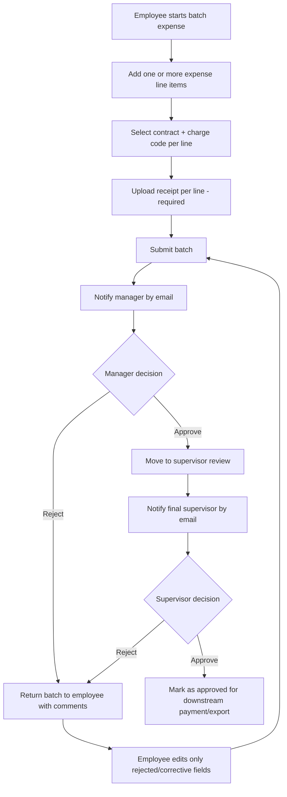

# Expense Submission and Multi-Step Approval Workflow

## Objective
Implement a workflow that supports:
1. Employee submission of **multiple expenses in one action**.
2. Association of each expense to a **valid contract charge code**.
3. **Mandatory receipt upload for each expense line item**.
4. Multi-step approvals with email notifications:
   - Employee submits -> Manager approval
   - Manager approves -> Final Supervisor approval
   - Any rejection -> Returned to employee for correction and resubmission

---

## Core Workflow

---

## Roles and Permissions

### Employee
- Create new expense batches.
- Add/edit/remove multiple expense lines before submission.
- Attach one receipt file per line item (or more, if business allows).
- View rejection reasons from manager or supervisor.
- Correct and resubmit rejected batches.

### Manager
- Review submitted expense batches assigned to their reporting employees.
- Approve or reject with required comments on rejection.
- Receive notification when a new batch is awaiting approval.

### Final Supervisor
- Review manager-approved batches.
- Approve or reject with required comments on rejection.
- Receive notification after manager approval.

### System/Admin (optional)
- Manage contracts and charge code lists.
- Configure approval routing and fallback approvers.

---

## Required States

Use a single `batch_status` plus per-line validation details.

- `DRAFT` - employee is editing
- `SUBMITTED_PENDING_MANAGER`
- `REJECTED_BY_MANAGER`
- `PENDING_SUPERVISOR`
- `REJECTED_BY_SUPERVISOR`
- `APPROVED_FINAL`
- `CANCELLED` (optional)

State transitions:
- `DRAFT -> SUBMITTED_PENDING_MANAGER`
- `SUBMITTED_PENDING_MANAGER -> PENDING_SUPERVISOR` (manager approval)
- `SUBMITTED_PENDING_MANAGER -> REJECTED_BY_MANAGER` (manager rejection)
- `PENDING_SUPERVISOR -> APPROVED_FINAL` (supervisor approval)
- `PENDING_SUPERVISOR -> REJECTED_BY_SUPERVISOR` (supervisor rejection)
- `REJECTED_BY_MANAGER|REJECTED_BY_SUPERVISOR -> SUBMITTED_PENDING_MANAGER` (resubmission)

---

## Data Model (Minimum)

### `contracts`
- `id`
- `contract_number`
- `name`
- `status`

### `charge_codes`
- `id`
- `contract_id` (FK)
- `code`
- `description`
- `active`

### `expense_batches`
- `id`
- `employee_id`
- `status`
- `submitted_at`
- `manager_id`
- `supervisor_id`
- `current_approver_id`
- `total_amount`
- `last_rejection_reason`
- `version` (optimistic locking)

### `expense_items`
- `id`
- `batch_id` (FK)
- `expense_date`
- `category`
- `description`
- `amount`
- `currency`
- `contract_id` (FK)
- `charge_code_id` (FK)
- `receipt_required` (always true)
- `validation_status`

### `expense_receipts`
- `id`
- `expense_item_id` (FK)
- `file_url`
- `file_name`
- `mime_type`
- `uploaded_by`
- `uploaded_at`

### `approval_actions`
- `id`
- `batch_id`
- `actor_id`
- `actor_role` (`MANAGER`/`SUPERVISOR`)
- `action` (`APPROVE`/`REJECT`)
- `comment`
- `acted_at`

### `notification_events`
- `id`
- `batch_id`
- `recipient_user_id`
- `channel` (`EMAIL`)
- `template_key`
- `status`
- `sent_at`
- `provider_message_id`

---

## Front-End Requirements

### Batch Entry Screen
- Grid/table allowing multiple rows in one submission.
- "Add Row" and "Remove Row" actions.
- Contract selector filtered by employee permissions/business rules.
- Charge code dropdown filtered by selected contract.
- Receipt upload control per row.
- Inline validation before submit.

### Validation Rules
On submit, each line must include:
- expense date
- amount > 0
- contract
- charge code valid for contract
- receipt attachment present

Submission should be blocked until all lines are valid.

### Review Screens
- Manager and supervisor screens show batch summary + all line details + receipts.
- Actions:
  - Approve
  - Reject (comment mandatory)

### Rework UX for Employee
- Display rejection source (manager/supervisor) and comments.
- Highlight lines likely needing corrections.
- Require re-submit after changes.

---

## Email Notification Workflow

### Events that send email
1. `BatchSubmitted` -> to manager
2. `ManagerApproved` -> to final supervisor
3. `ManagerRejected` -> to employee
4. `SupervisorRejected` -> to employee
5. `SupervisorApproved` -> optional confirmation to employee + finance

### Email content
Every email should include:
- Batch ID
- Employee name
- Total amount
- Submission/decision timestamp
- Approval/rejection comment (when relevant)
- Deep link to review page

### Reliability controls
- Queue-based async sending (outbox pattern recommended).
- Retry with exponential backoff.
- Dead-letter handling + alerting after repeated failures.

---

## API Contract (Example)

- `POST /expense-batches` - create draft batch
- `POST /expense-batches/{id}/items` - add one or many items
- `POST /expense-batches/{id}/submit` - validate and submit to manager
- `POST /expense-batches/{id}/manager/approve`
- `POST /expense-batches/{id}/manager/reject`
- `POST /expense-batches/{id}/supervisor/approve`
- `POST /expense-batches/{id}/supervisor/reject`
- `GET /contracts`
- `GET /contracts/{id}/charge-codes`

---

## Business Rules Summary

1. A batch must contain at least one expense line.
2. Every line must have a receipt before submission.
3. Charge code must belong to selected contract and be active.
4. Rejection always requires a comment.
5. Rejected batches return to employee and can be resubmitted.
6. Supervisor review is only available after manager approval.
7. All approvals/rejections are audit logged.

---

## Security and Compliance

- Role-based access control for employee/manager/supervisor/admin.
- Signed URLs or secure object storage for receipts.
- File scanning for malware.
- PII-safe logs; avoid attachment contents in logs.
- Immutable audit trail for approval actions.

---

## Suggested Implementation Sequence

1. Build core entities (`batch`, `item`, `receipt`, `approval_action`).
2. Implement front-end multi-line entry + per-line receipt validation.
3. Add manager approval APIs and screens.
4. Add supervisor approval APIs and screens.
5. Add email notification events + async dispatcher.
6. Add reporting/audit exports and operational dashboards.

